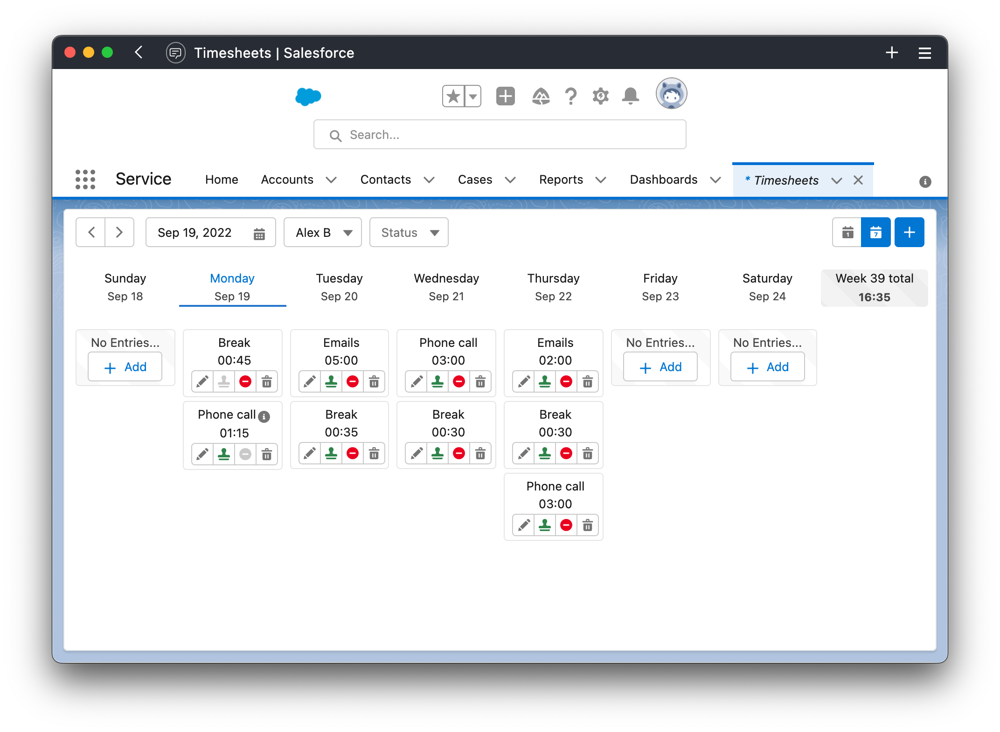

# Configuration

## Entry types

This component will allow managers to quickly manage Entry types.

  
Watch video

  <video width="640" controls preload autoplay>
    <source src="/video/entry-manager.mp4" />
  </video>

## Agent component

This component will enable agents to submit reports of their work.

## Manager component

This component will enable managers to overview agents reports and approve or reject their submissions.
