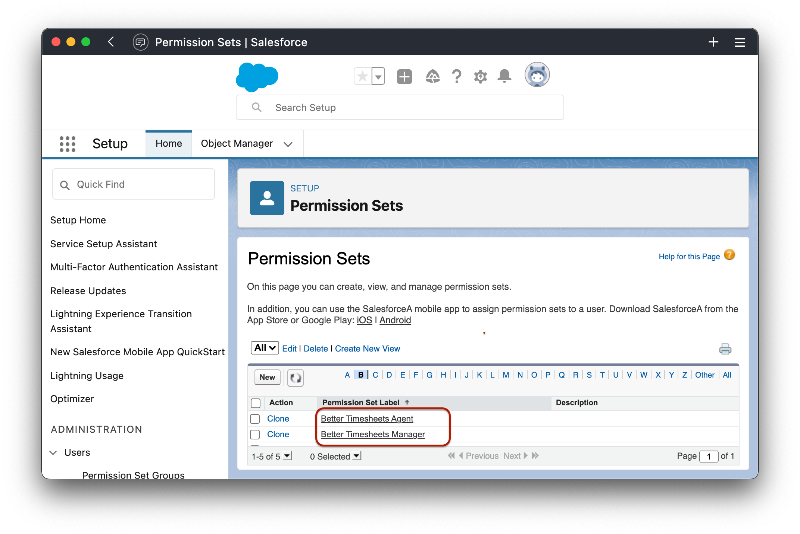
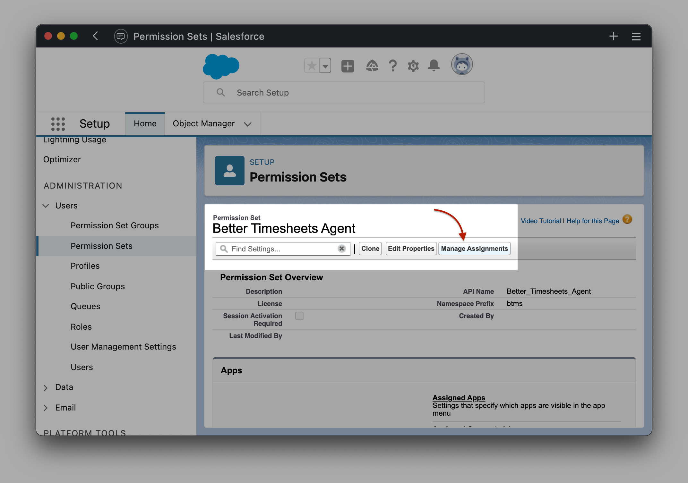

# User Pemissions

There are two Permission Sets provided with the package:

- **Better Timesheets Agent** - for agents submitting their time sheets
- **Better Timesheets Manager** - for managers approving the time sheets and managing the available Entry Types

## Assign Permission Set To Users

- Navigate to `Setup > Users > Permission Sets` and locate the provided Permission Sets
  
- Click on the relevant Permission Set and click on `Manage Assignments` button to assign the relevant users to the role
  
