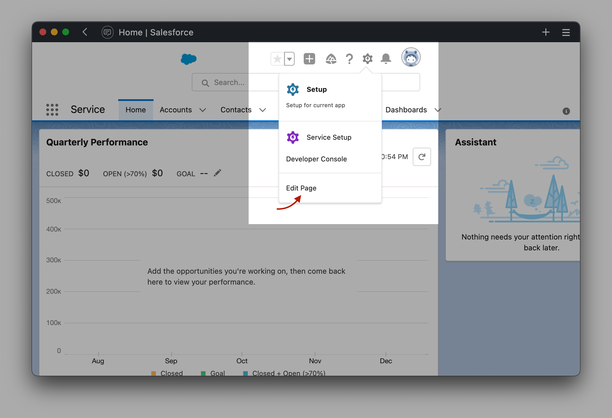
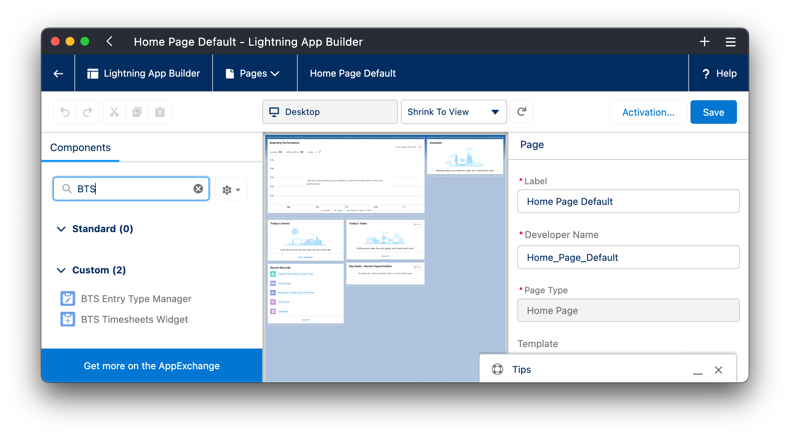
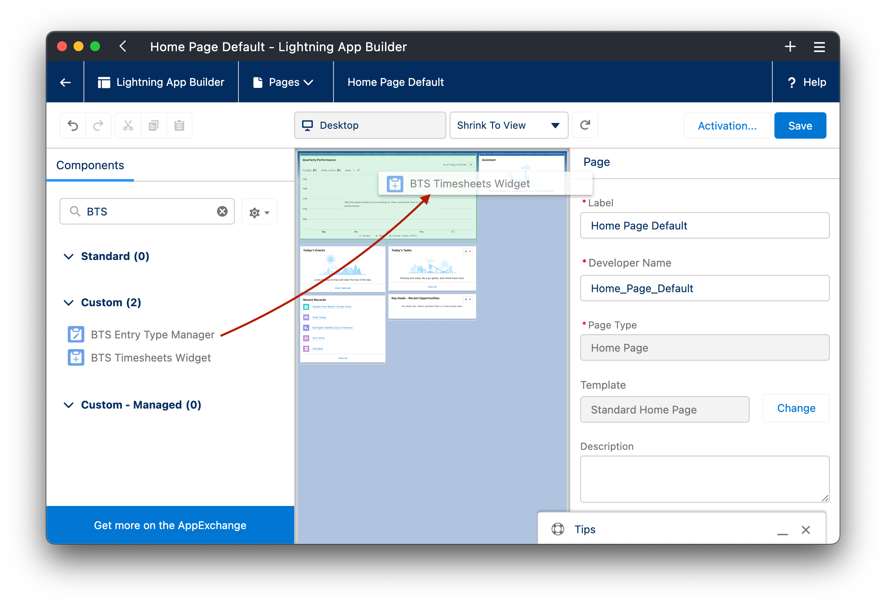
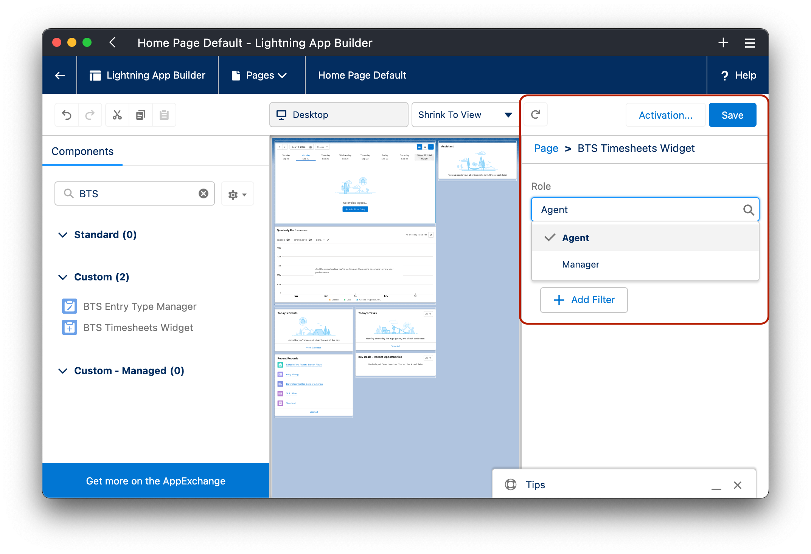
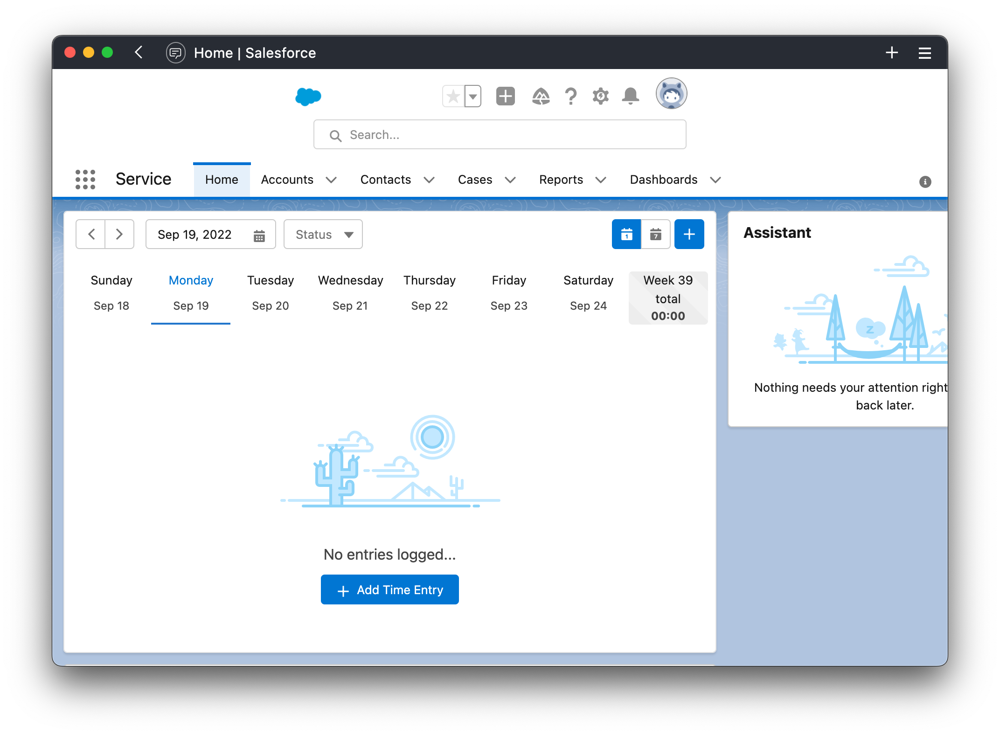

# Adding and Configuring Widgets

:::tip
Our widgets are designed to be added to any Lightning App or Page
:::

To add any of the widgets navigate to any Lightning location of choice and click on `Edit Page` from the `Setup` menu

Next, locate the widgets by searching `BTS` in the Components search field

Drag the components to any location of choice in your Lightning Page

Review and configure the component settings and visibility, click `Save` once done

Click `Back` and the component should be available on the Lightning Page, to change settings or visibility filters click on `Edit Page` again and revisit the component settings.

