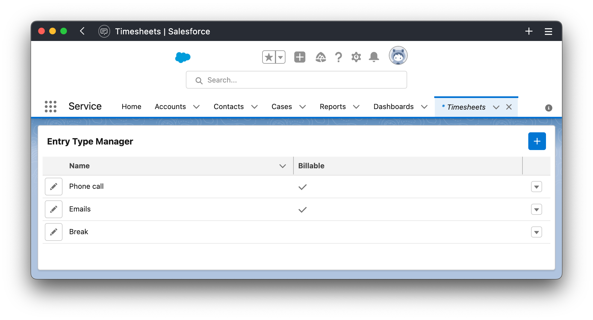

# Widgets

## Entry Types Widget

:::info
This widget is for **Managers**
:::

This widget will allow managers to quickly manage Entry Types.

  
Watch video

  <video width="640" controls preload autoplay>
    <source src="/video/entry-manager.mp4" />
  </video>

## Time Sheets Widget

:::info
This widget can be configured for **Agents** and **Managers**
:::

When configured for **Agent Role** the widget will allow agents to submit reports of their work

When configured to **Manager Role** the widget will allow managers to review the time sheets submissions, approve or reject them

